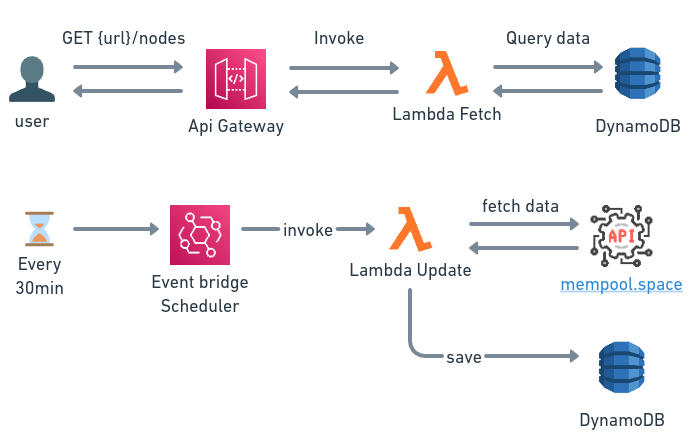

# rust-lightning-node-rankings

## Architecture



## DynamoDB Structure

### Table: NodesRankingTable

| Key Type   | Key Name                | Description                                                |
| ---------- | ----------------------- | ---------------------------------------------------------- |
| PK         | NODE                    | Partition Key                                              |
| SK         | PUBLIC_KEY#{public_key} | Sort Key                                                   |
| LSI1       | {channels}              | Local Secondary Index - used to sort by number of channels |
| public_key | String                  | Public key of the node                                     |
| channels   | Number                  | Number of channels of the node                             |
| capacity   | Number                  | Capacity of the node in bitcoins                           |
| alias      | String                  | Alias of the node                                          |
| first_seen | Number                  | ISO 8601 timestamp of the first time the node was seen     |
| updatedAt  | Number                  | unix timestamp of the last time the node was updated       |

## Project structure

```bash
backend/
├── common/ # common code shared between the lambdas
├── fetch_nodes/ # src code for a lambda that fetch the nodes from the Lightning Network that is activated by api gateway
├── update_node_rankings/ # src code for a lambda function that update the node rankings using event bridge scheduler
template.yaml # SAM template
samconfig.toml # SAM default configuration file
```

## Build tools & versions used

- SAM CLI - [Install the SAM CLI](https://docs.aws.amazon.com/serverless-application-model/latest/developerguide/serverless-sam-cli-install.html)
- [Rust](https://www.rust-lang.org/) version 1.64.0 or newer
- [cargo-lambda](https://github.com/cargo-lambda/cargo-lambda) for cross-compilation

## Steps to run the app

PS: You will need a AWS account and a AWS_ACCESS_KEY_ID and AWS_SECRET_ACCESS_KEY configured in your
environment under .aws/credentials

To build and deploy your application for the first time, run the following in your shell:

```bash
sam build
# uses the default aws profile
sam deploy
```

To delete the sample application that you created you can run the following:

```bash
sam delete
```

## Tests

To run the tests on the update_node_rankings folder, execute the following command:

```bash
cargo test
```

## What was the reason for your focus? What problems were you trying to solve?

Learn about Rust while using it in a serverless environment and about the lightning network.

## How long did you spend on this project?

About 8 hours.

## Did you make any trade-offs for this project? What would you have done differently with more time?

Yes, I made some trade-offs. With more time, I would like to implement a more robust code/software design using hexagonal architecture and add more tests. Additionally, I would improve the backend by adding more features like caching, query pagination, and better error handling.

## What do you think is the weakest part of your project?

The weakest part is the lack of a more robust code/software design.
